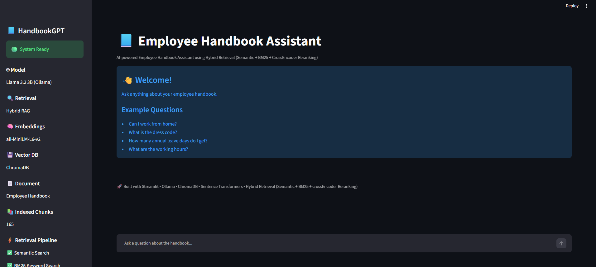
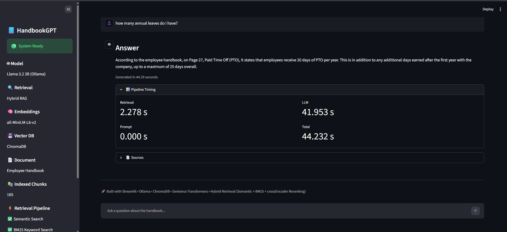

# 📘 Employee Handbook RAG Assistant

An AI-powered Employee Handbook Assistant built using Retrieval-Augmented Generation (RAG). The application answers employee questions by retrieving relevant information from an employee handbook using Hybrid Retrieval (Semantic Search + BM25) and CrossEncoder reranking before generating responses with Llama 3.2 running locally through Ollama.

## Preview

### Home



### Chat



## Features

- Hybrid Retrieval (Semantic Search + BM25)
- CrossEncoder Reranking
- ChromaDB Vector Database
- SentenceTransformer Embeddings
- Local LLM using Ollama (Llama 3.2 3B)
- Source Attribution
- Performance Metrics
- Streamlit Web Interface

## Tech Stack

| Category | Technology |
|----------|------------|
| Programming Language | Python |
| Frontend | Streamlit |
| LLM | Llama 3.2 3B (Ollama) |
| Embedding Model | all-MiniLM-L6-v2 |
| Vector Database | ChromaDB |
| Keyword Retrieval | BM25 |
| Reranker | CrossEncoder (ms-marco-MiniLM-L-6-v2) |
| PDF Processing | PyMuPDF |
| ML Framework | Sentence Transformers |

## Architecture

```text
                  Employee Handbook (PDF)
                            │
                            ▼
                     PDF Loader (PyMuPDF)
                            │
                            ▼
                     Text Cleaning
                            │
                            ▼
                     Text Chunking
                            │
          ┌─────────────────┴─────────────────┐
          ▼                                   ▼
SentenceTransformer                   BM25 Index
          ▼                                   ▼
      ChromaDB                     Keyword Search
          └──────────────┬────────────────────┘
                         ▼
                 Hybrid Retrieval
                         ▼
              CrossEncoder Reranker
                         ▼
                  Prompt Builder
                         ▼
              Llama 3.2 (Ollama)
                         ▼
               Streamlit Web App
```

## Installation

### 1. Clone the repository

```bash
git clone https://github.com/<your-username>/employee-handbook-rag.git
cd employee-handbook-rag
```

### 2. Create a virtual environment

```bash
python -m venv venv
```

Activate it:

**Windows**

```bash
venv\Scripts\activate
```

**Linux / macOS**

```bash
source venv/bin/activate
```

### 3. Install dependencies

```bash
pip install -r requirements.txt
```

## Run the Application

Start the Streamlit application:

```bash
streamlit run streamlit_app.py
```

The application will open in your browser at:

```text
http://localhost:8501
```

## Project Structure

```text
employee-handbook-rag/
│
├── app/
│   ├── ingestion/
│   ├── llm/
│   ├── retrieval/
│   ├── services/
│   └── vectordb/
│
├── data/
│   └── raw/
│
├── tests/
│
├── streamlit_app.py
├── main.py
├── requirements.txt
└── README.md
```

## Sample Questions

- What are the working hours?
- Can I work from home?
- What is the dress code?
- How many annual leave days do I get?
- Is smoking allowed?
- What benefits do full-time employees receive?
- What is the overtime policy?

## Future Improvements

- Conversation memory
- Multi-document support
- PDF upload through the UI
- Response streaming
- Citation highlighting
- Docker deployment
- Authentication

## License

This project is developed for learning and portfolio purposes.

## How it Works

1. The employee handbook PDF is loaded and cleaned.
2. The document is split into smaller chunks.
3. Chunks are converted into embeddings using Sentence Transformers.
4. Embeddings are stored in ChromaDB.
5. User questions are searched using Hybrid Retrieval:
   - Semantic Search
   - BM25 Keyword Search
6. Retrieved chunks are reranked using a CrossEncoder.
7. The top-ranked context is passed to Llama 3.2 through Ollama.
8. The assistant generates an answer along with the relevant source pages.